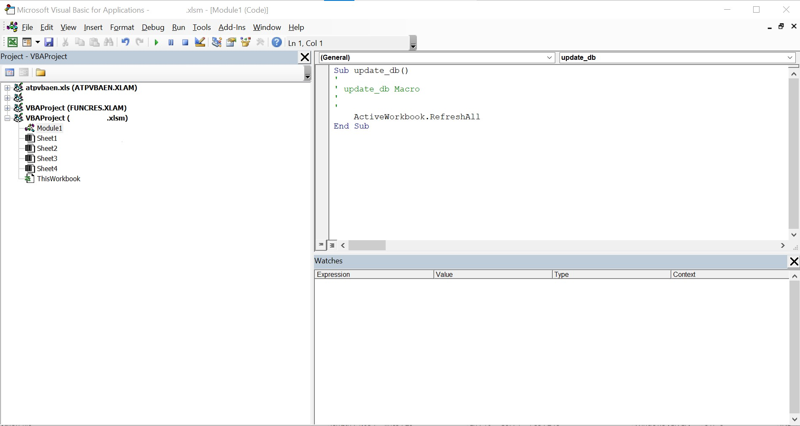

# pyrunxlsmacro

This is a simple python3 script to run specific macros in excel macro-enabled workbooks.

## Use case:
Automate the update of database export to excel trough OLEDB link: useful when you have to feed a MS DB to python but your enterprise security rules prevent direct link. The file can then be read with  for easy manipulation.

## Description
Based on win32com.client.
runMacro function is fed with filename and macro name. 
The xlsm file is open ```workbook = excel_macro.Workbooks.Open(Filename = excel_path, ReadOnly =1)```, the macro is run ```excel_macro.Application.Run(macropath)``` and then file is saved ```workbook.Save()``` (in case the macro makes some changes to the file itself) and closed ```excel_macro.Application.Quit()```.

macropath is constructed as the concatenation of ```[excel filename].xlsm + '!' + [macro_name]```

## Excel macro
To run the query, we need to create a VBA macro. in this example it's called "update_db":

```
Sub update_db()
'
' update_db Macro
'
'
    ActiveWorkbook.RefreshAll
End Sub
```

